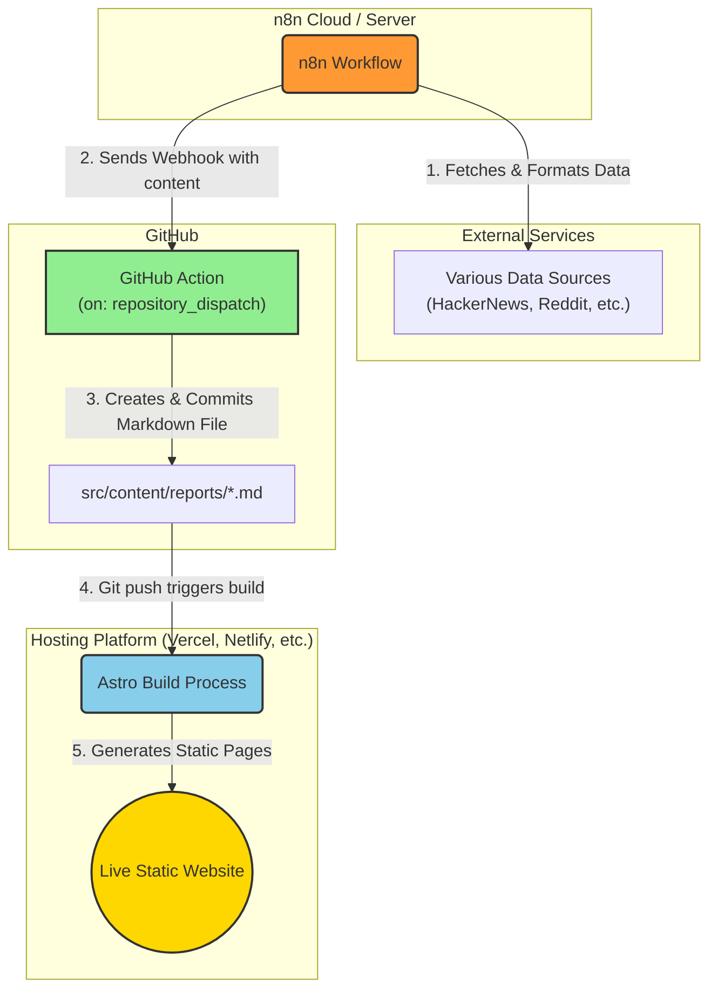

# n8n-driven-content-hub

An automated content hub powered by n8n and Astro. This project automatically fetches information from various sources (like Hacker News, Reddit, YouTube, etc.) and publishes it as a static website.

<!--  -->

<!-- Please replace with your project screenshot link -->

## How It Works
This project uses a simple yet powerful automation pipeline to keep the content updated. Here’s a step-by-step breakdown of the workflow:



1. Fetch Data: An n8n Workflow runs on a schedule or is triggered to fetch new content from various APIs and RSS feeds.

2. Trigger Update: After collecting and formatting the data, n8n sends a webhook to the GitHub repository.

3. GitHub Action: This webhook triggers a GitHub Action which takes the payload (the formatted content) and creates a new Markdown file inside the src/content/reports/ directory.

4. Build & Deploy: The push of the new commit to the main branch automatically triggers a new build process on Cloudflare (you can also choose other static hosting platform like Vercel or Netlify).

5. Go Live: Astro builds the site, generating static HTML pages from the Markdown files, and the new content goes live.

## Tech Stack
- n8n: Used for data scraping and workflow automation.

- GitHub Actions: Handles CI/CD, receiving webhooks from n8n to automatically update the repository content.

- Astro: Powers the fast, content-driven static site.

- TypeScript: Ensures type safety throughout the project.

## Features
- Automated Content Updates: Content is updated automatically via n8n workflows without manual intervention.

- Dynamic Routing: Each report is automatically generated as a separate, unique page using Astro's file-based routing.

- Interactive UI: Supports filtering content by source (Tabs) and keyword searching.

- Responsive Design: Optimized for both desktop and mobile viewing.

- Dark Mode: Automatically adapts to your system's color scheme.

## Project Structure
A brief overview of the key directories and files:

```
├── .github/workflows/          # GitHub Actions workflow configuration
├── public/                     # Static assets (CSS, JS, images)
├── src/
│   ├── content/reports/        # Stores all intelligence reports in Markdown format
│   ├── layouts/                # Astro layout components
│   └── pages/                  # Astro pages for routing and rendering
├── astro.config.mjs            # Astro configuration file
└── package.json                # Project dependencies and scripts
```

## Getting Started
### Prerequisites
- Node.js (18.x or higher)

- npm

### Installation
1. Clone the repository:

    ```bash
    git clone [https://github.com/Rarestq/n8n-driven-content-hub.git](https://github.com/Rarestq/n8n-driven-content-hub.git)
    ```

2. Navigate to the project directory:

    ```bash
    cd n8n-driven-content-hub
    ```

3. Install dependencies:

    ```bash
    npm install
    ```

### Local Development
Run the development server:

```bash
npm run dev
```

Open your browser to `http://localhost:4321` to see the result.

### Build
To build the project for production:

```bash
npm build
```

The static files will be generated in the `dist/` directory.

## Deployment
This project can be deployed to any static site hosting service, such as:

- Vercel

- Netlify

- Cloudflare Pages

- GitHub Pages

## Sponsor

<a href='https://ko-fi.com/rarestzhou' target='_blank'></a>

## Contact
Email: 📮 rarestzhou@gmail.com

Twitter: [@rarestzhou](https://x.com/rarestzhou)

## License
This project is licensed under the GNU General Public License v3.0. See the LICENSE file for more details.